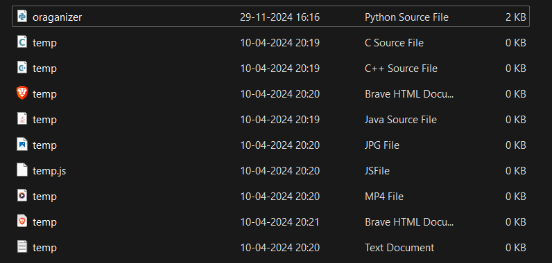
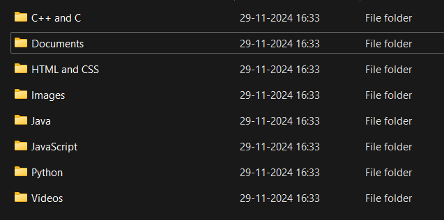

# File Organizer Script

## Overview
This Python script organizes files into categorized folders based on their extensions. It is ideal for cleaning up a directory by sorting files into folders like "Documents," "Images," "Python," and more.

## Supported Categories
- **Documents**: `.pdf`, `.docx`, `.xlsx`, etc.
- **Images**: `.jpg`, `.png`, `.gif`, etc.
- **Videos**: `.mp4`, `.mkv`, `.avi`, etc.
- **Pyhton**: `.py`
- **HTML and CSS**: `.html`, `.css`
- **JavaScript**: `.js`
- **Java**:  `.java`
- **C++ and C**: `.cpp`, `.c`

## How to Run the Script
1. Open a terminal or command prompt.
2. Navigate to the folder where the script is located.
3. Run the following command:
   ```bash
   python organizer.py

## Before 


## After 
